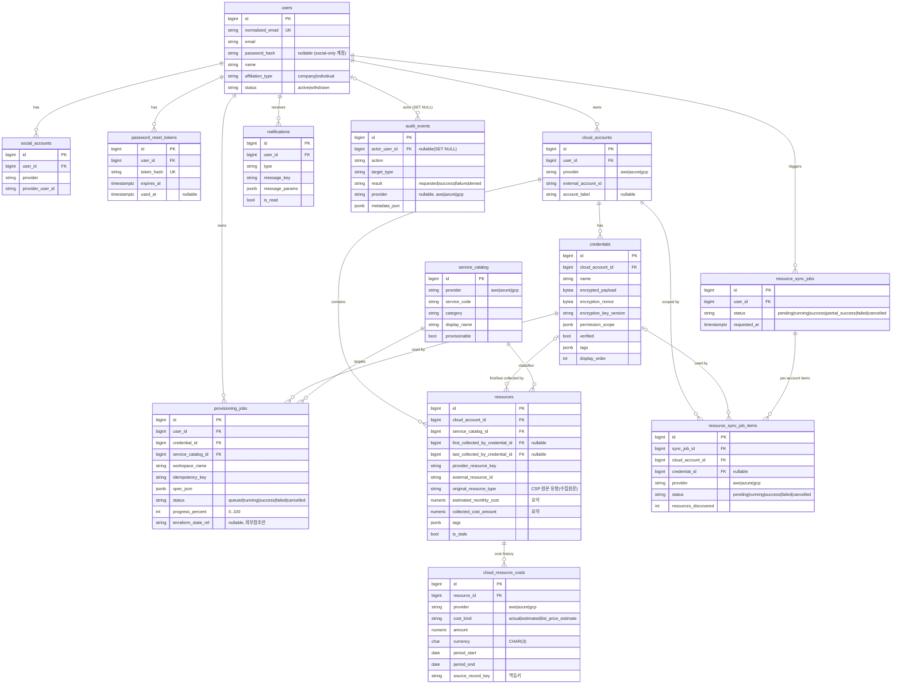

# DB ERD — Multi-Cloud Platform (v1.1)

현재 구축된 데이터베이스(PostgreSQL)의 ERD 및 스키마 문서.
**이 버전은 실제 기동한 DB에 접속해 스키마를 introspection으로 대조·검증한 결과다.**

## 문서 버전 정보

| 항목 | 값 |
|---|---|
| 문서 버전 | **v1.1** |
| 검증 방식 | `docker compose up`으로 실제 Postgres 기동 → `alembic upgrade head` 적용 → `information_schema` / `pg_catalog` introspection |
| DB 이미지 | `postgres:16` |
| Alembic head | `0caab346f140` (revert unified provisioning/resource-type api support) ← `2964dfe0a706` (phase 2 db enhancements) ← `7bf7892874c3` (initial schema) |
| 검증 시점 스키마 규모 | 테이블 13개(+`alembic_version`), FK 18, UNIQUE 12, CHECK 24 |
| 소스 | `backend/app/models.py` + `backend/alembic/versions/*` (실 DB와 일치 확인됨, `alembic check` diff 없음) |
| 검증 기준일 | 2026-09-10 |

> 이전 `docs/DB_ERD.md`(모델 정의만 보고 작성한 미검증본)를 `v1.0`이 대체했고, 이 문서(`v1.1`)가 다시 `v1.0`을 대체한다.
> 스키마 변경 시 마이그레이션과 함께 이 문서의 버전을 올린다(v1.2, v2.0 …).

### 변경 이력

| 버전 | 기준일 | 변경 |
|---|---|---|
| v1.0 | 2026-09-10 | 실 DB introspection 기반 최초 검증본(테이블 15, head `2964dfe0a706`). |
| **v1.1** | 2026-09-10 | 이전 API 명세(provider별 개별 엔드포인트) 유지 결정에 따라, 신규 통합 API 전용으로만 추가됐던 `provisioning_requests`·`resource_types` 두 테이블과 그 참조 컬럼(`provisioning_jobs.provisioning_request_id`, `resources.resource_type_id`)을 제거(head `0caab346f140`, 테이블 15→13). credentials 암호화·Account/Credential 분리·인벤토리 캐시·비용/감사 구조 등 나머지 개선은 유지. |

---

## 1. 개요

| 도메인 | 테이블 |
|---|---|
| 계정·인증 | `users`, `social_accounts`, `password_reset_tokens` |
| 클라우드 연결·자격증명 | `cloud_accounts`, `credentials` |
| 서비스 분류 | `service_catalog` |
| 프로비저닝 | `provisioning_jobs` |
| 인벤토리(리소스 수집) | `resources`, `resource_sync_jobs`, `resource_sync_job_items` |
| 비용 | `cloud_resource_costs` (+ `resources`의 cost_* 요약 컬럼) |
| 알림·감사 | `notifications`, `audit_events` |

도메인 테이블 **13개** (그 외 Alembic 관리용 `alembic_version` 1개).

> **v1.0 대비 제거**: `resource_types`, `provisioning_requests`. 이전 API 명세(provider별 개별
> 엔드포인트)에서는 통합 요청 부모(`provisioning_requests`)나 정규화 리소스 유형 테이블
> (`resource_types`)이 필요 없어, 이들을 위해 추가됐던 스키마 조각을 되돌렸다. `provisioning_jobs`는
> `provisioning_request_id` 없이 독립 실행 단위로 관리하고, `resources`는 수집 원문 컬럼
> `original_resource_type`만 유지한다.

### 설계 원칙 (모델 docstring 기준)
- **비밀/민감정보 저장 금지**: 자격증명 값은 `credentials.encrypted_payload`(암호화)로만 저장. `spec_json`/`metadata_json` 등 JSONB에는 access/secret key, SA JSON, 복호화된 payload, 원본 토큰을 넣지 않는다.
- **Terraform state 미저장**: state 본문·output은 DB에 두지 않고 외부 백엔드(S3/GCS 등) 참조(`terraform_state_ref`)만 저장.
- **작업 상태는 앱 계층 책임**: `provisioning_jobs.status`는 앱이 실행 결과를 반영해 갱신(DB 트리거 없음).
- **감사 로그 불변**: `audit_events`는 수정/삭제 API를 만들지 않는다.

### 검증 시점 실제 데이터(seed)
`python -m app.seed`로 `service_catalog` 12행이 적재되어 있고, 나머지 업무 테이블은 0행(빈 스키마)이었다.

| provider | 적재된 service_code |
|---|---|
| aws | ec2, rds, s3, cloudfront |
| azure | vm, sql_database, storage_account, cdn |
| gcp | compute_engine, cloud_sql, cloud_storage, cloud_cdn |

12행 모두 `provisionable = true`. 카테고리: `compute`, `db_rdbms`, `storage_object`, `cdn`.

> v1.0에서는 `resource_types`도 마이그레이션이 12행 시드했으나, v1.1에서 해당 테이블이 제거되며 시드도 함께 사라졌다.

---

## 2. ERD (Mermaid)



> GitHub은 Mermaid `erDiagram`을 렌더링한다. 관계 표기: `||` 정확히 1, `o{` 0..N, `|o` 0..1.

---

## 3. 관계(외래키) 요약 — 실 DB introspection 결과

아래 18개 FK와 `ON DELETE` 규칙은 실제 DB `pg_constraint`에서 그대로 확인한 값이다.

| 자식 테이블 | 컬럼 | 부모 테이블 | ON DELETE |
|---|---|---|---|
| social_accounts | user_id | users | CASCADE |
| password_reset_tokens | user_id | users | CASCADE |
| cloud_accounts | user_id | users | RESTRICT |
| credentials | cloud_account_id | cloud_accounts | CASCADE |
| provisioning_jobs | user_id | users | RESTRICT |
| provisioning_jobs | credential_id | credentials | RESTRICT |
| provisioning_jobs | service_catalog_id | service_catalog | RESTRICT |
| notifications | user_id | users | CASCADE |
| resources | cloud_account_id | cloud_accounts | CASCADE |
| resources | service_catalog_id | service_catalog | RESTRICT |
| resources | first_collected_by_credential_id | credentials | SET NULL |
| resources | last_collected_by_credential_id | credentials | SET NULL |
| cloud_resource_costs | resource_id | resources | CASCADE |
| resource_sync_jobs | user_id | users | RESTRICT |
| resource_sync_job_items | sync_job_id | resource_sync_jobs | CASCADE |
| resource_sync_job_items | cloud_account_id | cloud_accounts | RESTRICT |
| resource_sync_job_items | credential_id | credentials | SET NULL |
| audit_events | actor_user_id | users | SET NULL |

> v1.0 대비 제거된 FK 5개: `resource_types.service_catalog_id`, `provisioning_requests.user_id`,
> `provisioning_requests.resource_type_id`, `provisioning_jobs.provisioning_request_id`,
> `resources.resource_type_id`.

**인덱스 참고**: 모든 FK 컬럼에는 단일 컬럼 B-tree 인덱스가 자동 생성되어 있고(`ix_<table>_<col>`), 아래 복합/특수 인덱스가 추가로 존재한다.
- `resources`: `(cloud_account_id, service_catalog_id)`, `(cloud_account_id, status)`, `(region)`, `(last_synced_at)`, `(tags)` **GIN**
- `cloud_resource_costs`: `(resource_id, period_start, period_end)`, `(provider, cost_kind, period_start)`, `(as_of)`
- `audit_events`: `(actor_user_id, created_at)`, `(target_type, target_id, created_at)`, `(action, created_at)`, `(request_id)`

---

## 4. 테이블 상세

모든 테이블은 `created_at timestamptz NOT NULL DEFAULT now()`(`CreatedAtMixin`)를 가진다.
아래 표에는 각 테이블 고유 컬럼만 정리한다. PK는 전부 `bigint` 자동 증가(`nextval` 시퀀스).
타입·NULL 여부·기본값·제약은 실 DB `information_schema.columns` / `pg_constraint`와 대조 완료.

### 4.1 users — 사용자
| 컬럼 | 타입 | Null | 기본값/제약 |
|---|---|---|---|
| id | bigint | N | PK |
| email | varchar(320) | N | 원본 이메일 |
| normalized_email | varchar(320) | N | **UNIQUE** (`users_normalized_email_key`) |
| password_hash | varchar | Y | 소셜 전용 계정이면 NULL |
| name | varchar(100) | N | |
| affiliation_type | varchar(20) | N | CHECK `IN ('company','individual')` |
| affiliation_name | varchar(200) | Y | |
| status | varchar(20) | N | default `active`, CHECK `IN ('active','withdrawn')` |
| updated_at | timestamptz | N | default now(), onupdate now() |
| withdrawn_at | timestamptz | Y | 탈퇴 시각 |

### 4.2 social_accounts — 소셜 로그인 연동
| 컬럼 | 타입 | Null | 제약 |
|---|---|---|---|
| user_id | bigint | N | FK→users (CASCADE), index |
| provider | varchar(50) | N | 예: google |
| provider_user_id | varchar(255) | N | |

UNIQUE: `(provider, provider_user_id)`, `(user_id, provider)`.

### 4.3 password_reset_tokens — 비밀번호 재설정 토큰
| 컬럼 | 타입 | Null | 제약 |
|---|---|---|---|
| user_id | bigint | N | FK→users (CASCADE), index |
| token_hash | varchar(255) | N | **UNIQUE** (원본 토큰 아님, 해시만 저장) |
| expires_at | timestamptz | N | 만료 시각 |
| used_at | timestamptz | Y | 사용 시각 |

### 4.4 cloud_accounts — 클라우드 계정 연결
| 컬럼 | 타입 | Null | 제약 |
|---|---|---|---|
| user_id | bigint | N | FK→users (RESTRICT), index |
| provider | varchar(20) | N | CHECK `IN ('aws','azure','gcp')` |
| external_account_id | varchar(255) | N | CSP 계정 식별자 |
| account_label | varchar(200) | Y | 사용자 지정 라벨 |
| updated_at | timestamptz | N | onupdate now() |

UNIQUE: `(user_id, provider, external_account_id)`.

### 4.5 credentials — 암호화 자격증명
| 컬럼 | 타입 | Null | 제약 |
|---|---|---|---|
| cloud_account_id | bigint | N | FK→cloud_accounts (CASCADE), index |
| name | varchar(200) | N | |
| encrypted_payload | bytea | N | 암호화된 자격증명 본문 |
| encryption_nonce | bytea | N | |
| encryption_key_version | varchar(50) | N | 키 로테이션 대응 |
| public_identifier | varchar(255) | Y | 비밀 아닌 식별자 |
| permission_scope | jsonb | N | default `{}` |
| verified | bool | N | default false |
| verified_at | timestamptz | Y | |
| tags | jsonb | N | default `{}` |
| display_order | int | N | default 0, CHECK `>= 0` |
| updated_at | timestamptz | N | onupdate now() |

UNIQUE: `(cloud_account_id, name)`.

### 4.6 service_catalog — 공통 서비스 분류
| 컬럼 | 타입 | Null | 제약 |
|---|---|---|---|
| provider | varchar(20) | N | CHECK `IN ('aws','azure','gcp')` |
| service_code | varchar(100) | N | 예: ec2 |
| category | varchar(100) | N | 예: compute |
| display_name | varchar(200) | N | |
| provisionable | bool | N | default false |
| updated_at | timestamptz | N | onupdate now() |

UNIQUE: `(provider, service_code)`. (검증 시점 12행 seed됨 — §1 참고)

### 4.7 provisioning_jobs — 프로비저닝 실행
한 credential · 한 provider · 한 Terraform workspace 단위 실행. (v1.0의 부모 `provisioning_requests`는 제거되어, 이 테이블이 독립 실행 단위다.)

| 컬럼 | 타입 | Null | 제약 |
|---|---|---|---|
| user_id | bigint | N | FK→users (RESTRICT), index |
| credential_id | bigint | N | FK→credentials (RESTRICT), index |
| service_catalog_id | bigint | N | FK→service_catalog (RESTRICT), index |
| workspace_name | varchar(255) | N | |
| idempotency_key | varchar(255) | N | |
| spec_json | jsonb | N | **secret 저장 금지** |
| status | varchar(30) | N | default `queued`, CHECK `IN ('queued','running','success','failed','cancelled')` |
| progress_percent | int | N | default 0, CHECK `0..100` |
| terraform_state_ref | varchar(1024) | Y | 외부 state 참조(본문 저장 X) |
| created_resource_count | int | N | default 0, CHECK `>= 0` |
| result_json | jsonb | Y | |
| error_code | varchar(100) | Y | |
| error_message | text | Y | |
| started_at / finished_at | timestamptz | Y | CHECK `finished_at >= started_at` |

UNIQUE: `(user_id, workspace_name)`, `(user_id, idempotency_key)`.

> `progress_percent` / `created_resource_count` / `terraform_state_ref`는 이전 API에서 필수는
> 아니지만 무해하고, 서버측 진행률 추적을 붙일 때 바로 쓸 수 있어 v1.1에서도 유지한다.

### 4.8 notifications — 알림
| 컬럼 | 타입 | Null | 제약 |
|---|---|---|---|
| user_id | bigint | N | FK→users (CASCADE), index |
| type | varchar(100) | N | |
| reference_type | varchar(100) | Y | 연관 엔티티 종류 |
| reference_id | bigint | Y | 연관 엔티티 id(느슨한 참조, FK 아님) |
| message_key | varchar(255) | N | i18n 메시지 키 |
| message_params | jsonb | N | default `{}` |
| is_read | bool | N | default false |
| read_at | timestamptz | Y | |

### 4.9 resources — 수집된 클라우드 리소스(인벤토리)
| 컬럼 | 타입 | Null | 제약 |
|---|---|---|---|
| cloud_account_id | bigint | N | FK→cloud_accounts (CASCADE), index |
| service_catalog_id | bigint | N | FK→service_catalog (RESTRICT), index |
| first_collected_by_credential_id | bigint | Y | FK→credentials (SET NULL), index |
| last_collected_by_credential_id | bigint | Y | FK→credentials (SET NULL), index |
| provider_resource_key | varchar(1024) | N | |
| external_resource_id | varchar(512) | N | |
| original_resource_type | varchar(255) | N | CSP 원본 유형(수집 원문) |
| name | varchar(512) | Y | |
| region | varchar(255) | Y | |
| status | varchar(100) | Y | |
| estimated_monthly_cost | numeric(19,6) | Y | CHECK `>= 0`, 최신 요약 스냅샷 |
| collected_cost_amount | numeric(19,6) | Y | CHECK `>= 0`, 최신 요약 스냅샷 |
| cost_currency | char(3) | Y | |
| cost_period_start / cost_period_end | date | Y | |
| cost_as_of | timestamptz | Y | |
| cost_source | varchar(100) | Y | |
| tags | jsonb | N | default `{}` |
| raw_metadata | jsonb | Y | |
| first_seen_at / last_seen_at | timestamptz | N | |
| is_stale | bool | N | default false |
| deleted_at | timestamptz | Y | soft delete |
| last_synced_at | timestamptz | Y | |
| updated_at | timestamptz | N | onupdate now() |

UNIQUE: `(cloud_account_id, provider_resource_key)`.
INDEX: `(cloud_account_id, service_catalog_id)`, `(cloud_account_id, status)`, `region`, `last_synced_at`, `tags` (GIN), + 각 FK 단일 인덱스.

> v1.0의 `resource_type_id`(→`resource_types`) 컬럼은 제거됐다. CSP 원본 유형은 수집 원문
> 컬럼 `original_resource_type`으로만 보존한다.

### 4.10 cloud_resource_costs — 비용 이력
`resources`의 cost_* 요약 컬럼과 별개인 **기간별 전체 이력**. `cost_kind`가 다른 값은 합산하지 않는다.

| 컬럼 | 타입 | Null | 제약 |
|---|---|---|---|
| resource_id | bigint | N | FK→resources (CASCADE), index |
| provider | varchar(20) | N | CHECK `IN ('aws','azure','gcp')` |
| cost_kind | varchar(30) | N | CHECK `IN ('actual','estimated','list_price_estimate')` |
| amount | numeric(19,6) | N | CHECK `>= 0` |
| currency | char(3) | N | |
| period_start / period_end | date | N | CHECK `period_end >= period_start` |
| as_of | timestamptz | N | |
| source | varchar(100) | N | |
| source_record_key | varchar(512) | N | 재수집 멱등 키 |
| metadata_json | jsonb | Y | |

UNIQUE: `(provider, source_record_key)`.
INDEX: `(resource_id, period_start, period_end)`, `(provider, cost_kind, period_start)`, `as_of`.

### 4.11 resource_sync_jobs — 리소스 동기화 작업(부모)
| 컬럼 | 타입 | Null | 제약 |
|---|---|---|---|
| user_id | bigint | N | FK→users (RESTRICT), index |
| status | varchar(30) | N | default `pending`, CHECK `IN ('pending','running','success','partial_success','failed','cancelled')` |
| requested_at | timestamptz | N | |
| started_at / finished_at | timestamptz | Y | |

### 4.12 resource_sync_job_items — 동기화 작업 항목(계정별)
| 컬럼 | 타입 | Null | 제약 |
|---|---|---|---|
| sync_job_id | bigint | N | FK→resource_sync_jobs (CASCADE), index |
| cloud_account_id | bigint | N | FK→cloud_accounts (RESTRICT), index |
| credential_id | bigint | Y | FK→credentials (SET NULL), index |
| provider | varchar(20) | N | CHECK `IN ('aws','azure','gcp')` |
| status | varchar(30) | N | default `pending`, CHECK `IN ('pending','running','success','failed','cancelled')` |
| resources_discovered/created/updated/marked_stale | int | N | default 0, 각 CHECK `>= 0` |
| error_code | varchar(100) | Y | |
| error_message | text | Y | |
| started_at / finished_at | timestamptz | Y | |

UNIQUE: `(sync_job_id, cloud_account_id)`.

### 4.13 audit_events — 감사 이벤트(불변)
보안·파괴적 작업 감사용. **수정/삭제 API 없음**, `metadata_json`에 민감정보 저장 금지.

| 컬럼 | 타입 | Null | 제약 |
|---|---|---|---|
| actor_user_id | bigint | Y | FK→users (SET NULL), index |
| action | varchar(100) | N | |
| target_type | varchar(100) | N | |
| target_id | varchar(255) | Y | |
| request_id | varchar(100) | Y | index |
| result | varchar(30) | N | CHECK `IN ('requested','success','failure','denied')` |
| provider | varchar(20) | Y | CHECK NULL 또는 `IN ('aws','azure','gcp')` |
| metadata_json | jsonb | N | default `{}` |

INDEX: `(actor_user_id, created_at)`, `(target_type, target_id, created_at)`, `(action, created_at)`, `(request_id)`.

---

## 5. Enum(문자열 CHECK) 값 모음 — 실 DB 확인

| 컬럼 | 허용 값 |
|---|---|
| users.affiliation_type | company, individual |
| users.status | active, withdrawn |
| provider (cloud_accounts / service_catalog / cloud_resource_costs / resource_sync_job_items) | aws, azure, gcp |
| audit_events.provider | (NULL) 또는 aws, azure, gcp |
| provisioning_jobs.status | queued, running, success, failed, cancelled |
| resource_sync_jobs.status | pending, running, success, partial_success, failed, cancelled |
| resource_sync_job_items.status | pending, running, success, failed, cancelled |
| cloud_resource_costs.cost_kind | actual, estimated, list_price_estimate |
| audit_events.result | requested, success, failure, denied |

---

## 6. 재현 방법 (검증 절차)

```bash
# 1) DB + API 기동 (api 엔트리포인트가 alembic upgrade head + seed 실행)
docker compose up -d --build api

# 2) 마이그레이션 head 확인
docker compose exec db psql -U mcp_user -d mcp_db -c "SELECT version_num FROM alembic_version;"
#  -> 0caab346f140

# 3) 스키마 introspection (테이블/FK/제약/인덱스)
docker compose exec db psql -U mcp_user -d mcp_db -c "\dt"      # 13개 도메인 테이블
docker compose exec db psql -U mcp_user -d mcp_db -c "\d+ <table>"

# 4) 모델 ↔ 스키마 일치 확인
docker compose exec api alembic check   # -> No new upgrade operations detected.

# 5) 정리
docker compose down -v   # -v 는 db 볼륨까지 삭제
```
