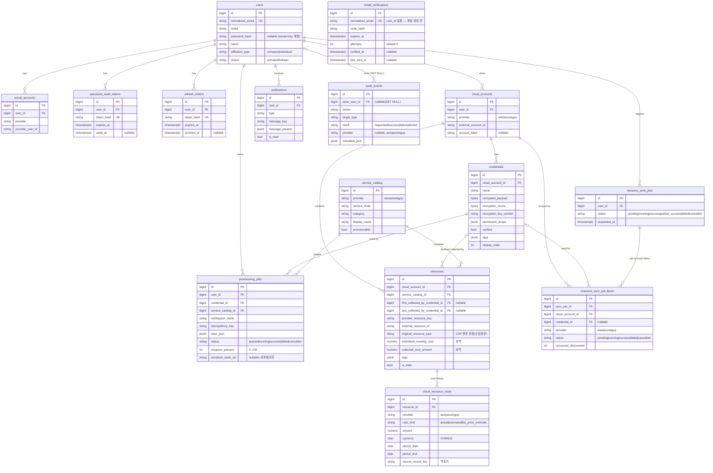
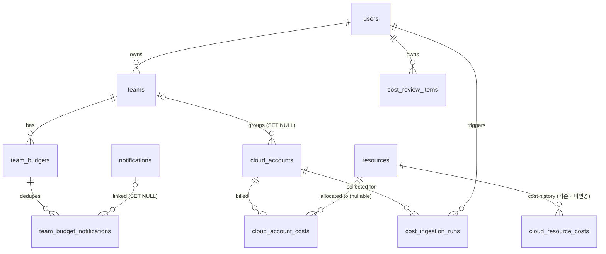

# DB ERD — Multi-Cloud Platform (v1.2)

현재 구축된 데이터베이스(PostgreSQL)의 ERD 및 스키마 문서.

> **이 문서는 두 부분으로 구성된다.** §1~§6(Part A)은 **실제 코드 기준으로 바로잡은 현재 스키마**이고,
> §7(Part B)은 **비용(Cost) 기능 확장을 위한 제안 스키마 — 아직 구현되지 않았다.**
> Part B는 `docs/비용_개발문서/06_DB변경.md`(2026-09-17/18, 이승현 작성, 팀 승인 전 초안)를 근거로 한다.
> Part B의 테이블·컬럼 개수는 **"추가 제안"**이며, 실제 Alembic 리비전이 만들어지고 `alembic check`로
> 재검증되기 전까지는 "구현 완료"를 의미하지 않는다.

## 문서 버전 정보

| 항목 | 값 |
|---|---|
| 문서 버전 | **v1.2** |
| Part A 검증 방식 | `backend/app/models.py` + `backend/alembic/versions/*` 직접 대조(introspection 재실행은 아직 하지 않음 — §6-1 참고) |
| Part B 검증 방식 | 설계 문서 대조만. **DB에 적용된 적 없음** |
| DB 이미지 | `postgres:16` |
| Alembic head (Part A, 실제) | **`a1b2c3d4e5f6`** ("auth: email verification + refresh tokens") ← `0caab346f140` ← `2964dfe0a706` ← `7bf7892874c3` |
| Part A 스키마 규모 | 도메인 테이블 **15개**(+`alembic_version`), FK **19**, UNIQUE 14, CHECK 26 |
| Part B가 추가 제안하는 규모 | 신규 테이블 **6개**, 신규 컬럼 **2개** → 적용되면 도메인 테이블 15 → **21**, FK 19 → **29** |
| 소스 | `backend/app/models.py`(Part A) · `docs/비용_개발문서/06_DB변경.md`(Part B) |
| 문서 기준일 | 2026-09-18 |

> 이전 `docs/DB_ERD.md`(모델 정의만 보고 작성한 미검증본)를 `v1.0`이 대체했고, `v1.1`이 `v1.0`을 대체했다.
> **`v1.1`은 두 리비전 뒤처져 있었다** — 실제 head가 `a1b2c3d4e5f6`(도메인 테이블 15개)로 이미 올라가
> 있었는데 `v1.1`은 `0caab346f140`(13개) 시점에 멈춰 있었다(`email_verifications`·`refresh_tokens`
> 누락). 이 문서(`v1.2`)가 `v1.1`을 대체하며 그 두 테이블을 Part A에 반영하고, 여기에 비용 확장
> 제안(Part B)을 새로 추가한다. **`v1.1` 파일은 팀 공식 문서로 그대로 남겨 둔다** — 이 문서가 완전히
> 대체하는 것은 다음 팀 검토·병합 이후다.
> 스키마 변경 시 마이그레이션과 함께 이 문서의 버전을 올린다(v1.3, v2.0 …).

### 변경 이력

| 버전 | 기준일 | 변경 |
|---|---|---|
| v1.0 | 2026-09-10 | 실 DB introspection 기반 최초 검증본(테이블 15, head `2964dfe0a706`). |
| v1.1 | 2026-09-10 | 이전 API 명세(provider별 개별 엔드포인트) 유지 결정에 따라, 신규 통합 API 전용으로만 추가됐던 `provisioning_requests`·`resource_types` 두 테이블과 그 참조 컬럼(`provisioning_jobs.provisioning_request_id`, `resources.resource_type_id`)을 제거(head `0caab346f140`, 테이블 15→13). credentials 암호화·Account/Credential 분리·인벤토리 캐시·비용/감사 구조 등 나머지 개선은 유지. |
| **v1.2** | 2026-09-18 | **Part A 보정**: `v1.1`이 반영하지 못한 인증 강화(2026-09-14, `solcho/be-auth-enhancements`) 결과 — `email_verifications`·`refresh_tokens` 2개 테이블 추가(head `a1b2c3d4e5f6`, 테이블 13→15), FK 18→19. **Part B 신설**: 비용(Cost) 기능을 위한 신규 테이블 6개·컬럼 2개를 **제안**으로 추가(`teams`, `team_budgets`, `team_budget_notifications`, `cloud_account_costs`, `cost_ingestion_runs`, `cost_review_items`, `cloud_accounts.team_id`, `resources.status_changed_at`). 기존 `cloud_resource_costs`·`resources`의 `cost_*` 컬럼은 **변경하지 않는다**. |

---

# Part A — 현재 스키마 (실제 코드 기준)

## 1. 개요

| 도메인 | 테이블 |
|---|---|
| 계정·인증 | `users`, `social_accounts`, `password_reset_tokens`, `email_verifications`, `refresh_tokens` |
| 클라우드 연결·자격증명 | `cloud_accounts`, `credentials` |
| 서비스 분류 | `service_catalog` |
| 프로비저닝 | `provisioning_jobs` |
| 인벤토리(리소스 수집) | `resources`, `resource_sync_jobs`, `resource_sync_job_items` |
| 비용 | `cloud_resource_costs` (+ `resources`의 cost_* 요약 컬럼) |
| 알림·감사 | `notifications`, `audit_events` |

도메인 테이블 **15개** (그 외 Alembic 관리용 `alembic_version` 1개).

> **v1.1 대비 추가**: `email_verifications`, `refresh_tokens`. 둘 다 2026-09-14
> `solcho/be-auth-enhancements` 세션(인증 강화 — `/me`·refresh token·이메일 검증(OTP)·비밀번호
> 재설정 + 실메일 발송)에서 마이그레이션 `a1b2c3d4e5f6`로 추가됐으나 `v1.1` 문서 갱신이 누락됐다.
> `v1.0 → v1.1` 변경(제거된 `resource_types`, `provisioning_requests`)은 그대로 유효하다.

### 설계 원칙 (모델 docstring 기준)
- **비밀/민감정보 저장 금지**: 자격증명 값은 `credentials.encrypted_payload`(암호화)로만 저장. `spec_json`/`metadata_json` 등 JSONB에는 access/secret key, SA JSON, 복호화된 payload, 원본 토큰을 넣지 않는다.
- **Terraform state 미저장**: state 본문·output은 DB에 두지 않고 외부 백엔드(S3/GCS 등) 참조(`terraform_state_ref`)만 저장.
- **작업 상태는 앱 계층 책임**: `provisioning_jobs.status`는 앱이 실행 결과를 반영해 갱신(DB 트리거 없음).
- **감사 로그 불변**: `audit_events`는 수정/삭제 API를 만들지 않는다.
- **토큰/코드는 해시만 저장**: `password_reset_tokens.token_hash`와 같은 규약을 `email_verifications.code_hash`·`refresh_tokens.token_hash`도 따른다. 원본은 응답 발급 시점에만 존재한다.

### 검증 시점 실제 데이터(seed)
`python -m app.seed`로 `service_catalog` 12행이 적재되어 있고, 나머지 업무 테이블은 0행(빈 스키마)이었다.

| provider | 적재된 service_code |
|---|---|
| aws | ec2, rds, s3, cloudfront |
| azure | vm, sql_database, storage_account, cdn |
| gcp | compute_engine, cloud_sql, cloud_storage, cloud_cdn |

12행 모두 `provisionable = true`. 카테고리: `compute`, `db_rdbms`, `storage_object`, `cdn`.

---

## 2. ERD (Mermaid) — Part A



> GitHub은 Mermaid `erDiagram`을 렌더링한다. 관계 표기: `||` 정확히 1, `o{` 0..N, `|o` 0..1.
> Part B(비용 확장 제안)의 엔터티는 이 다이어그램에 넣지 않았다 — §7-5에 별도 다이어그램이 있다.

---

## 3. 관계(외래키) 요약 — Part A, 실제 19개

| 자식 테이블 | 컬럼 | 부모 테이블 | ON DELETE |
|---|---|---|---|
| social_accounts | user_id | users | CASCADE |
| password_reset_tokens | user_id | users | CASCADE |
| refresh_tokens | user_id | users | CASCADE |
| cloud_accounts | user_id | users | RESTRICT |
| credentials | cloud_account_id | cloud_accounts | CASCADE |
| provisioning_jobs | user_id | users | RESTRICT |
| provisioning_jobs | credential_id | credentials | RESTRICT |
| provisioning_jobs | service_catalog_id | service_catalog | RESTRICT |
| notifications | user_id | users | CASCADE |
| resources | cloud_account_id | cloud_accounts | CASCADE |
| resources | service_catalog_id | service_catalog | RESTRICT |
| resources | first_collected_by_credential_id | credentials | SET NULL |
| resources | last_collected_by_credential_id | credentials | SET NULL |
| cloud_resource_costs | resource_id | resources | CASCADE |
| resource_sync_jobs | user_id | users | RESTRICT |
| resource_sync_job_items | sync_job_id | resource_sync_jobs | CASCADE |
| resource_sync_job_items | cloud_account_id | cloud_accounts | RESTRICT |
| resource_sync_job_items | credential_id | credentials | SET NULL |
| audit_events | actor_user_id | users | SET NULL |

> `v1.1` 대비 추가: `refresh_tokens.user_id`(CASCADE). `email_verifications`는 FK가 없다 —
> 계정 생성 전 이메일 기준으로만 키를 잡기 때문이다(`normalized_email` UNIQUE).

**인덱스 참고**: 모든 FK 컬럼에는 단일 컬럼 B-tree 인덱스가 자동 생성되어 있고(`ix_<table>_<col>`), 아래 복합/특수 인덱스가 추가로 존재한다.
- `resources`: `(cloud_account_id, service_catalog_id)`, `(cloud_account_id, status)`, `(region)`, `(last_synced_at)`, `(tags)` **GIN**
- `cloud_resource_costs`: `(resource_id, period_start, period_end)`, `(provider, cost_kind, period_start)`, `(as_of)`
- `audit_events`: `(actor_user_id, created_at)`, `(target_type, target_id, created_at)`, `(action, created_at)`, `(request_id)`

---

## 4. 테이블 상세 — Part A

모든 테이블은 `created_at timestamptz NOT NULL DEFAULT now()`(`CreatedAtMixin`)를 가진다.
아래 표에는 각 테이블 고유 컬럼만 정리한다. PK는 전부 `bigint` 자동 증가(`nextval` 시퀀스).

### 4.1 users — 사용자
| 컬럼 | 타입 | Null | 기본값/제약 |
|---|---|---|---|
| id | bigint | N | PK |
| email | varchar(320) | N | 원본 이메일 |
| normalized_email | varchar(320) | N | **UNIQUE** (`users_normalized_email_key`) |
| password_hash | varchar | Y | 소셜 전용 계정이면 NULL |
| name | varchar(100) | N | |
| affiliation_type | varchar(20) | N | CHECK `IN ('company','individual')` |
| affiliation_name | varchar(200) | Y | |
| status | varchar(20) | N | default `active`, CHECK `IN ('active','withdrawn')` |
| updated_at | timestamptz | N | default now(), onupdate now() |
| withdrawn_at | timestamptz | Y | 탈퇴 시각 |

### 4.2 social_accounts — 소셜 로그인 연동
| 컬럼 | 타입 | Null | 제약 |
|---|---|---|---|
| user_id | bigint | N | FK→users (CASCADE), index |
| provider | varchar(50) | N | 예: google |
| provider_user_id | varchar(255) | N | |

UNIQUE: `(provider, provider_user_id)`, `(user_id, provider)`.

### 4.3 password_reset_tokens — 비밀번호 재설정 토큰
| 컬럼 | 타입 | Null | 제약 |
|---|---|---|---|
| user_id | bigint | N | FK→users (CASCADE), index |
| token_hash | varchar(255) | N | **UNIQUE** (원본 토큰 아님, 해시만 저장) |
| expires_at | timestamptz | N | 만료 시각 |
| used_at | timestamptz | Y | 사용 시각 |

### 4.4 email_verifications — 회원가입 전 이메일 검증(OTP) · v1.1에 누락됐던 테이블

회원가입 전 이메일 소유 확인용. 계정이 아직 없으므로 `user_id`가 아니라 **이메일 기준**으로 키를 잡는다.
같은 이메일로 재전송하면 기존 미검증 행을 갱신(overwrite)한다.

| 컬럼 | 타입 | Null | 제약 |
|---|---|---|---|
| normalized_email | varchar(320) | N | **UNIQUE** |
| code_hash | varchar(255) | N | 6자리 코드의 해시(SHA-256). 평문 저장 안 함 |
| expires_at | timestamptz | N | 발급 후 10분 |
| attempts | int | N | default 0. 5회 제한 |
| verified_at | timestamptz | Y | 검증 완료 시각 |
| last_sent_at | timestamptz | Y | 재전송 60초 rate-limit 판정용 |
| updated_at | timestamptz | N | onupdate now() |

FK 없음 — 관련 라우터: `POST /auth/email-verifications`, `POST /auth/email-verifications/verify`.
`POST /auth/sign-up`은 최근 30분 내 검증 완료 레코드가 없으면 `422 EMAIL_NOT_VERIFIED`, 성공 시 이 레코드를 소비(삭제)한다.

### 4.5 refresh_tokens — 회전(rotation)하는 opaque refresh token · v1.1에 누락됐던 테이블

JWT가 아니라 DB에 해시로 저장하는 opaque 토큰. `POST /auth/login`이 access(1h)+refresh(14d)를 함께
발급하고, `POST /auth/refresh`는 기존 토큰을 폐기(`revoked_at`)하며 새 쌍을 발급한다.

| 컬럼 | 타입 | Null | 제약 |
|---|---|---|---|
| user_id | bigint | N | FK→users (CASCADE), index |
| token_hash | varchar(255) | N | **UNIQUE** (SHA-256, `hmac.compare_digest`로 대조) |
| expires_at | timestamptz | N | 발급 후 14일 |
| revoked_at | timestamptz | Y | 회전·로그아웃·비밀번호 재설정 시 기록 |

### 4.6 cloud_accounts — 클라우드 계정 연결
| 컬럼 | 타입 | Null | 제약 |
|---|---|---|---|
| user_id | bigint | N | FK→users (RESTRICT), index |
| provider | varchar(20) | N | CHECK `IN ('aws','azure','gcp')` |
| external_account_id | varchar(255) | N | CSP 계정 식별자 |
| account_label | varchar(200) | Y | 사용자 지정 라벨 |
| updated_at | timestamptz | N | onupdate now() |

UNIQUE: `(user_id, provider, external_account_id)`.

> Part B가 이 테이블에 `team_id` 컬럼 추가를 제안한다 — §7-2 R1.

### 4.7 credentials — 암호화 자격증명
| 컬럼 | 타입 | Null | 제약 |
|---|---|---|---|
| cloud_account_id | bigint | N | FK→cloud_accounts (CASCADE), index |
| name | varchar(200) | N | |
| encrypted_payload | bytea | N | 암호화된 자격증명 본문 |
| encryption_nonce | bytea | N | |
| encryption_key_version | varchar(50) | N | 키 로테이션 대응 |
| public_identifier | varchar(255) | Y | 비밀 아닌 식별자 |
| permission_scope | jsonb | N | default `{}` |
| verified | bool | N | default false |
| verified_at | timestamptz | Y | |
| tags | jsonb | N | default `{}` |
| display_order | int | N | default 0, CHECK `>= 0` |
| updated_at | timestamptz | N | onupdate now() |

UNIQUE: `(cloud_account_id, name)`.

### 4.8 service_catalog — 공통 서비스 분류
| 컬럼 | 타입 | Null | 제약 |
|---|---|---|---|
| provider | varchar(20) | N | CHECK `IN ('aws','azure','gcp')` |
| service_code | varchar(100) | N | 예: ec2 |
| category | varchar(100) | N | 예: compute |
| display_name | varchar(200) | N | |
| provisionable | bool | N | default false |
| updated_at | timestamptz | N | onupdate now() |

UNIQUE: `(provider, service_code)`. (검증 시점 12행 seed됨 — §1 참고)

### 4.9 provisioning_jobs — 프로비저닝 실행
한 credential · 한 provider · 한 Terraform workspace 단위 실행.

| 컬럼 | 타입 | Null | 제약 |
|---|---|---|---|
| user_id | bigint | N | FK→users (RESTRICT), index |
| credential_id | bigint | N | FK→credentials (RESTRICT), index |
| service_catalog_id | bigint | N | FK→service_catalog (RESTRICT), index |
| workspace_name | varchar(255) | N | |
| idempotency_key | varchar(255) | N | |
| spec_json | jsonb | N | **secret 저장 금지** |
| status | varchar(30) | N | default `queued`, CHECK `IN ('queued','running','success','failed','cancelled')` |
| progress_percent | int | N | default 0, CHECK `0..100` |
| terraform_state_ref | varchar(1024) | Y | 외부 state 참조(본문 저장 X) |
| created_resource_count | int | N | default 0, CHECK `>= 0` |
| result_json | jsonb | Y | |
| error_code | varchar(100) | Y | |
| error_message | text | Y | |
| started_at / finished_at | timestamptz | Y | CHECK `finished_at >= started_at` |

UNIQUE: `(user_id, workspace_name)`, `(user_id, idempotency_key)`.

### 4.10 notifications — 알림
| 컬럼 | 타입 | Null | 제약 |
|---|---|---|---|
| user_id | bigint | N | FK→users (CASCADE), index |
| type | varchar(100) | N | |
| reference_type | varchar(100) | Y | 연관 엔티티 종류 |
| reference_id | bigint | Y | 연관 엔티티 id(느슨한 참조, FK 아님) |
| message_key | varchar(255) | N | i18n 메시지 키 |
| message_params | jsonb | N | default `{}` |
| is_read | bool | N | default false |
| read_at | timestamptz | Y | |

> Part B가 `type='budget_threshold'` 행을 이 테이블에 추가로 쌓을 것을 제안한다 — 테이블 자체는 변경하지 않는다(§7-2 R2).

### 4.11 resources — 수집된 클라우드 리소스(인벤토리)
| 컬럼 | 타입 | Null | 제약 |
|---|---|---|---|
| cloud_account_id | bigint | N | FK→cloud_accounts (CASCADE), index |
| service_catalog_id | bigint | N | FK→service_catalog (RESTRICT), index |
| first_collected_by_credential_id | bigint | Y | FK→credentials (SET NULL), index |
| last_collected_by_credential_id | bigint | Y | FK→credentials (SET NULL), index |
| provider_resource_key | varchar(1024) | N | |
| external_resource_id | varchar(512) | N | |
| original_resource_type | varchar(255) | N | CSP 원본 유형(수집 원문) |
| name | varchar(512) | Y | |
| region | varchar(255) | Y | |
| status | varchar(100) | Y | |
| estimated_monthly_cost | numeric(19,6) | Y | CHECK `>= 0`, 최신 요약 스냅샷 |
| collected_cost_amount | numeric(19,6) | Y | CHECK `>= 0`, 최신 요약 스냅샷 |
| cost_currency | char(3) | Y | |
| cost_period_start / cost_period_end | date | Y | |
| cost_as_of | timestamptz | Y | |
| cost_source | varchar(100) | Y | |
| tags | jsonb | N | default `{}` |
| raw_metadata | jsonb | Y | |
| first_seen_at / last_seen_at | timestamptz | N | |
| is_stale | bool | N | default false |
| deleted_at | timestamptz | Y | soft delete |
| last_synced_at | timestamptz | Y | |
| updated_at | timestamptz | N | onupdate now() |

UNIQUE: `(cloud_account_id, provider_resource_key)`.
INDEX: `(cloud_account_id, service_catalog_id)`, `(cloud_account_id, status)`, `region`, `last_synced_at`, `tags` (GIN), + 각 FK 단일 인덱스.

> Part B가 `status_changed_at` 컬럼 추가를 제안한다 — §7-2 R0.

### 4.12 cloud_resource_costs — 비용 이력
`resources`의 cost_* 요약 컬럼과 별개인 **기간별 전체 이력**. `cost_kind`가 다른 값은 합산하지 않는다.

| 컬럼 | 타입 | Null | 제약 |
|---|---|---|---|
| resource_id | bigint | N | FK→resources (CASCADE), index |
| provider | varchar(20) | N | CHECK `IN ('aws','azure','gcp')` |
| cost_kind | varchar(30) | N | CHECK `IN ('actual','estimated','list_price_estimate')` |
| amount | numeric(19,6) | N | CHECK `>= 0` |
| currency | char(3) | N | |
| period_start / period_end | date | N | CHECK `period_end >= period_start` |
| as_of | timestamptz | N | |
| source | varchar(100) | N | |
| source_record_key | varchar(512) | N | 재수집 멱등 키 |
| metadata_json | jsonb | Y | |

UNIQUE: `(provider, source_record_key)`.
INDEX: `(resource_id, period_start, period_end)`, `(provider, cost_kind, period_start)`, `as_of`.

> **Part B는 이 테이블을 손대지 않는다.** 계정 단위 실측 비용(음수 허용, 리소스에 귀속되지 않는
> 금액)은 신규 테이블 `cloud_account_costs`가 대신한다 — 이유는 §7-3.

### 4.13 resource_sync_jobs — 리소스 동기화 작업(부모)
| 컬럼 | 타입 | Null | 제약 |
|---|---|---|---|
| user_id | bigint | N | FK→users (RESTRICT), index |
| status | varchar(30) | N | default `pending`, CHECK `IN ('pending','running','success','partial_success','failed','cancelled')` |
| requested_at | timestamptz | N | |
| started_at / finished_at | timestamptz | Y | |

### 4.14 resource_sync_job_items — 동기화 작업 항목(계정별)
| 컬럼 | 타입 | Null | 제약 |
|---|---|---|---|
| sync_job_id | bigint | N | FK→resource_sync_jobs (CASCADE), index |
| cloud_account_id | bigint | N | FK→cloud_accounts (RESTRICT), index |
| credential_id | bigint | Y | FK→credentials (SET NULL), index |
| provider | varchar(20) | N | CHECK `IN ('aws','azure','gcp')` |
| status | varchar(30) | N | default `pending`, CHECK `IN ('pending','running','success','failed','cancelled')` |
| resources_discovered/created/updated/marked_stale | int | N | default 0, 각 CHECK `>= 0` |
| error_code | varchar(100) | Y | |
| error_message | text | Y | |
| started_at / finished_at | timestamptz | Y | |

UNIQUE: `(sync_job_id, cloud_account_id)`.

### 4.15 audit_events — 감사 이벤트(불변)
보안·파괴적 작업 감사용. **수정/삭제 API 없음**, `metadata_json`에 민감정보 저장 금지.

| 컬럼 | 타입 | Null | 제약 |
|---|---|---|---|
| actor_user_id | bigint | Y | FK→users (SET NULL), index |
| action | varchar(100) | N | |
| target_type | varchar(100) | N | |
| target_id | varchar(255) | Y | |
| request_id | varchar(100) | Y | index |
| result | varchar(30) | N | CHECK `IN ('requested','success','failure','denied')` |
| provider | varchar(20) | Y | CHECK NULL 또는 `IN ('aws','azure','gcp')` |
| metadata_json | jsonb | N | default `{}` |

INDEX: `(actor_user_id, created_at)`, `(target_type, target_id, created_at)`, `(action, created_at)`, `(request_id)`.

---

## 5. Enum(문자열 CHECK) 값 모음 — Part A

| 컬럼 | 허용 값 |
|---|---|
| users.affiliation_type | company, individual |
| users.status | active, withdrawn |
| provider (cloud_accounts / service_catalog / cloud_resource_costs / resource_sync_job_items) | aws, azure, gcp |
| audit_events.provider | (NULL) 또는 aws, azure, gcp |
| provisioning_jobs.status | queued, running, success, failed, cancelled |
| resource_sync_jobs.status | pending, running, success, partial_success, failed, cancelled |
| resource_sync_job_items.status | pending, running, success, failed, cancelled |
| cloud_resource_costs.cost_kind | actual, estimated, list_price_estimate |
| audit_events.result | requested, success, failure, denied |

---

## 6. 재현 방법 (검증 절차)

```bash
# 1) DB + API 기동 (api 엔트리포인트가 alembic upgrade head + seed 실행)
docker compose up -d --build api

# 2) 마이그레이션 head 확인
docker compose exec db psql -U mcp_user -d mcp_db -c "SELECT version_num FROM alembic_version;"
#  -> a1b2c3d4e5f6

# 3) 스키마 introspection (테이블/FK/제약/인덱스)
docker compose exec db psql -U mcp_user -d mcp_db -c "\dt"      # 15개 도메인 테이블
docker compose exec db psql -U mcp_user -d mcp_db -c "\d+ <table>"

# 4) 모델 ↔ 스키마 일치 확인
docker compose exec api alembic check   # -> No new upgrade operations detected.

# 5) 정리
docker compose down -v   # -v 는 db 볼륨까지 삭제
```

### 6-1. ⚠️ 이 문서에서 하지 않은 것

Part A는 `backend/app/models.py`와 Alembic 리비전 체인을 **직접 대조**해 작성했지만, `v1.0`·`v1.1`처럼
실제 `docker compose up` 기동 후 `information_schema`/`pg_catalog` introspection으로 재검증하지는
않았다. 팀이 이 문서를 공식 채택하기 전에 §6의 절차로 한 번 더 검증하는 것을 권장한다.

---

# Part B — 비용(Cost) 기능 확장 스키마 (제안 · 미구현)

> ⚠️ **아래 전부는 제안이다.** 어떤 Alembic 리비전도 아직 만들어지지 않았고 실제 DB에 적용된 적이
> 없다. 근거 문서는 `docs/비용_개발문서/06_DB변경.md`(작성 2026-09-17, 팀 승인 전 초안)이며, 그
> 문서의 리비전 ID(`c0a1b2c3d4e5` 등)는 전부 **예시**다 — 실제 구현 시 `alembic revision`이 발급하는
> 해시를 쓴다.

## 7-1. 왜 새 테이블인가 — 기존 비용 스키마를 건드리지 않는 이유

| 테이블/컬럼 | 지금 | 이번 제안의 처리 |
|---|---|---|
| `cloud_resource_costs` (전체) | `resource_id` **NOT NULL** FK · `amount >= 0` CHECK · `cost_kind IN ('actual','estimated','list_price_estimate')` | **손대지 않는다** |
| `resources.estimated_monthly_cost` 등 cost_* 5개 | 최신 실측/추정 요약 스냅샷 | 스키마 불변. 값을 채우는 코드만 바뀐다 |
| `notifications` | 알림 | 스키마 불변. `type='budget_threshold'` 행만 늘어난다 |
| `credentials.permission_scope` | JSONB | 스키마 불변. capability 판정이 이 값을 참고만 한다 |

이유는 둘이다.
1. `cloud_resource_costs.resource_id`가 **NOT NULL**이라 리소스에 귀속되지 않는 계정 단위 금액(데이터
   전송료·지원 요금·크레딧)을 넣을 자리가 없다.
2. `amount >= 0` CHECK가 있어 **크레딧·환불(음수)**을 넣을 수 없다.

두 제약을 완화하는 대신, 계정 단위·음수 허용 실측 비용을 위한 **새 테이블 `cloud_account_costs`**를
만든다(§7-3-3). 기존 테이블은 프로비저닝이 채우는 정가 추정치 전용으로 남는다.

## 7-2. 리비전 요약 (제안)

| 리비전(예시 ID) | 목적 | 신규 테이블 | 기존 테이블 변경 | 의존 |
|---|---|---|---|---|
| **R0** | 상태 변경 시각 기록 시작 | 없음 | `resources.status_changed_at` 추가 | head(`a1b2c3d4e5f6`) |
| **R1** | 팀 | `teams` | `cloud_accounts.team_id` 추가 | R0 |
| **R2** | 예산 | `team_budgets`, `team_budget_notifications` | 없음 | R1 |
| **R3** | 실측 수집 | `cloud_account_costs`, `cost_ingestion_runs` | 없음 | R2 |
| **R4** | 검토 큐 | `cost_review_items` | 없음 | R3 |

적용되면 도메인 테이블 **15 → 21**, FK **19 → 29**(+10), 신규 UNIQUE 4, 신규 CHECK 17, 신규 인덱스 18.

```
a1b2c3d4e5f6 (head, 실제)
      ↓
R0  resources.status_changed_at
      ↓
R1 → R2 → R3 → R4
```

### R0 — `resources.status_changed_at`

```sql
ALTER TABLE resources ADD COLUMN status_changed_at timestamptz NULL;
CREATE INDEX ix_resources_status_changed_at ON resources (status_changed_at);
```

- 최적화 추천(유휴/장기정지 판정)은 "상태가 언제 바뀌었는지"가 필요하고, 이 시각은 **소급 계산이
  불가능**하다 — 지금 기록을 시작하지 않으면 나중에 만들 방법이 없다.
- 값이 실제로 달라진 경우에만 `now()`로 갱신한다(`backend/app/routers/sync_jobs.py`의
  `_upsert_discovered_resources`). 신규 행은 `NULL`(= "언제 바뀌었는지 모른다", 0일로 취급하지 않는다).

### R1 — `teams` + `cloud_accounts.team_id`

```sql
CREATE TABLE teams (
    id          bigserial     PRIMARY KEY,
    user_id     bigint        NOT NULL REFERENCES users(id) ON DELETE CASCADE,
    name        varchar(200)  NOT NULL,
    currency    char(3)       NOT NULL DEFAULT 'USD',
    created_at  timestamptz   NOT NULL DEFAULT now(),
    updated_at  timestamptz   NOT NULL DEFAULT now(),
    CONSTRAINT uq_teams_user_name UNIQUE (user_id, name)
);
CREATE INDEX ix_teams_user_id ON teams (user_id);

ALTER TABLE cloud_accounts
    ADD COLUMN team_id bigint NULL REFERENCES teams(id) ON DELETE SET NULL;
CREATE INDEX ix_cloud_accounts_team_id ON cloud_accounts (team_id);
```

- 팀은 "한 사용자 안의 그룹"이다 — 팀원 간 공유(조직 RBAC)는 범위 밖. `teams.user_id`는 `CASCADE`(팀은
  라벨일 뿐이라 사용자와 함께 사라져도 된다), `cloud_accounts.team_id`는 `SET NULL`(**팀을 지워도
  계정과 비용 데이터는 남는다**).
- `currency`를 팀에 두는 이유 — 한 팀 안에 USD·KRW 계정이 섞이면 예산 소진율을 한 숫자로 낼 수 없다.
  예산 한도 자체는 `teams`에 두지 않는다(이력 보존을 위해 `team_budgets`로 분리, 아래 R2).
- **DB로 강제하지 못하고 애플리케이션이 검사하는 것**: 이미 수집된 금액이 있는 팀의 통화 변경 금지
  (`PATCH /teams/{id}` → `409 CONFLICT`), 통화 불일치 계정의 예산 자동 제외(계정을 팀에서 자동으로
  빼지는 않는다).

### R2 — `team_budgets` + `team_budget_notifications`

```sql
CREATE TABLE team_budgets (
    id            bigserial      PRIMARY KEY,
    team_id       bigint         NOT NULL REFERENCES teams(id) ON DELETE CASCADE,
    period_type   varchar(20)    NOT NULL,
    start_date    date           NOT NULL,
    end_date      date           NULL,          -- custom 만 값을 가진다. 제외 경계로 저장
    limit_amount  numeric(19,6)  NOT NULL,
    currency      char(3)        NOT NULL DEFAULT 'USD',
    created_at    timestamptz    NOT NULL DEFAULT now(),
    updated_at    timestamptz    NOT NULL DEFAULT now(),

    CONSTRAINT ck_team_budgets_period_type
        CHECK (period_type IN ('monthly','quarterly','annual','custom')),
    CONSTRAINT ck_team_budgets_limit_positive
        CHECK (limit_amount > 0),
    CONSTRAINT ck_team_budgets_custom_end_required
        CHECK ((period_type = 'custom' AND end_date IS NOT NULL)
            OR (period_type <> 'custom' AND end_date IS NULL)),
    CONSTRAINT ck_team_budgets_end_after_start
        CHECK (end_date IS NULL OR end_date > start_date),
    CONSTRAINT ck_team_budgets_custom_max_one_year
        CHECK (end_date IS NULL OR end_date <= start_date + INTERVAL '1 year')
);
CREATE INDEX ix_team_budgets_team_id ON team_budgets (team_id);
CREATE INDEX ix_team_budgets_team_period ON team_budgets (team_id, period_type, start_date);

CREATE TABLE team_budget_notifications (
    id               bigserial     PRIMARY KEY,
    team_budget_id   bigint        NOT NULL REFERENCES team_budgets(id) ON DELETE CASCADE,
    period_start     date          NOT NULL,     -- 어느 예산 주기인지
    threshold        smallint      NOT NULL,     -- 80 또는 100
    notification_id  bigint        NULL REFERENCES notifications(id) ON DELETE SET NULL,
    notified_at      timestamptz   NOT NULL DEFAULT now(),
    created_at       timestamptz   NOT NULL DEFAULT now(),

    CONSTRAINT ck_team_budget_notifications_threshold
        CHECK (threshold IN (80, 100)),
    CONSTRAINT uq_team_budget_notifications_key
        UNIQUE (team_budget_id, period_start, threshold)
);
CREATE INDEX ix_team_budget_notifications_team_budget_id
    ON team_budget_notifications (team_budget_id);
```

- **반복 예산의 한도를 바꿀 때 기존 행을 수정하지 않는다** — 새 행을 추가해 이력을 남긴다(과거 기간의
  예산 대비 수치가 소급 변경되지 않게 하기 위해). `end_date IS NULL`인 행이 반복 예산이고, 같은 팀의
  다음 행 `start_date`가 사실상의 종료다.
- `team_budget_notifications`의 `UNIQUE (team_budget_id, period_start, threshold)`가 임계 알림의
  **최초 1회 발송**을 보장한다 — INSERT가 성공했을 때만 알림을 만들고, 알림 행과 이 중복방지 행은
  **같은 트랜잭션**에 저장한다(하나가 실패하면 함께 롤백).
- **DB로 강제하지 못하는 것**: 팀당 활성 반복 주기 1개(`POST /teams/{id}/budgets` → `409 CONFLICT`),
  `custom`끼리 기간 겹침 금지(`btree_gist` 확장 없이 애플리케이션이 검사 → `409
  BUDGET_PERIOD_OVERLAP`).

### R3 — `cloud_account_costs` + `cost_ingestion_runs`

```sql
CREATE TABLE cloud_account_costs (
    id                bigserial      PRIMARY KEY,
    cloud_account_id  bigint         NOT NULL REFERENCES cloud_accounts(id) ON DELETE CASCADE,
    resource_id       bigint         NULL     REFERENCES resources(id)      ON DELETE SET NULL,
    provider          varchar(20)    NOT NULL,
    cost_kind         varchar(30)    NOT NULL DEFAULT 'actual',
    charge_category   varchar(20)    NOT NULL DEFAULT 'usage',
    service           varchar(255)   NULL,         -- CSP 원본 서비스명(AmazonEC2 등). NULL = 서비스 미분류 금액
    amount            numeric(19,6)  NOT NULL,     -- 음수 허용 (크레딧·환불). CHECK 걸지 않는다
    currency          char(3)        NOT NULL,
    period_start      date           NOT NULL,     -- 포함
    period_end        date           NOT NULL,     -- 제외
    is_estimated       boolean        NOT NULL DEFAULT false,
    as_of             timestamptz    NOT NULL,
    source            varchar(100)   NOT NULL,     -- 'aws_cost_explorer' | 'azure_cost_management' | 'gcp_billing_export'
    source_record_key varchar(512)   NOT NULL,
    tags              jsonb          NOT NULL DEFAULT '{}'::jsonb,   -- 태그 배분은 설계만, 이번엔 미사용
    metadata_json     jsonb          NULL,
    created_at        timestamptz    NOT NULL DEFAULT now(),

    CONSTRAINT ck_cloud_account_costs_provider
        CHECK (provider IN ('aws','azure','gcp')),
    CONSTRAINT ck_cloud_account_costs_cost_kind
        CHECK (cost_kind IN ('actual')),
    CONSTRAINT ck_cloud_account_costs_charge_category
        CHECK (charge_category IN ('usage','credit','refund','tax','other')),
    CONSTRAINT ck_cloud_account_costs_period_end_after_start
        CHECK (period_end > period_start),
    CONSTRAINT uq_cloud_account_costs_provider_source_record_key
        UNIQUE (provider, source_record_key)
);
CREATE INDEX ix_cloud_account_costs_cloud_account_id ON cloud_account_costs (cloud_account_id);
CREATE INDEX ix_cloud_account_costs_resource_id      ON cloud_account_costs (resource_id);
CREATE INDEX ix_cloud_account_costs_account_period   ON cloud_account_costs (cloud_account_id, period_start, period_end);
CREATE INDEX ix_cloud_account_costs_provider_period  ON cloud_account_costs (provider, period_start);
CREATE INDEX ix_cloud_account_costs_service_period   ON cloud_account_costs (cloud_account_id, service, period_start);
CREATE INDEX ix_cloud_account_costs_as_of            ON cloud_account_costs (as_of);
CREATE INDEX ix_cloud_account_costs_tags_gin         ON cloud_account_costs USING gin (tags);

CREATE TABLE cost_ingestion_runs (
    id                bigserial     PRIMARY KEY,
    user_id           bigint        NOT NULL REFERENCES users(id)          ON DELETE CASCADE,
    cloud_account_id  bigint        NOT NULL REFERENCES cloud_accounts(id) ON DELETE CASCADE,
    trigger_type      varchar(20)   NOT NULL,
    status            varchar(30)   NOT NULL DEFAULT 'pending',
    period_start      date          NOT NULL,
    period_end        date          NOT NULL,
    requested_at      timestamptz   NOT NULL,
    started_at        timestamptz   NULL,
    finished_at       timestamptz   NULL,
    api_calls         integer       NOT NULL DEFAULT 0,
    records_replaced  integer       NOT NULL DEFAULT 0,
    error_code        varchar(100)  NULL,
    error_message     text          NULL,
    created_at        timestamptz   NOT NULL DEFAULT now(),

    CONSTRAINT ck_cost_ingestion_runs_trigger_type
        CHECK (trigger_type IN ('auto','manual')),
    CONSTRAINT ck_cost_ingestion_runs_status
        CHECK (status IN ('pending','running','success','partial_success','failed','cancelled')),
    CONSTRAINT ck_cost_ingestion_runs_api_calls_non_negative
        CHECK (api_calls >= 0),
    CONSTRAINT ck_cost_ingestion_runs_period_end_after_start
        CHECK (period_end > period_start)
);
CREATE INDEX ix_cost_ingestion_runs_user_id           ON cost_ingestion_runs (user_id);
CREATE INDEX ix_cost_ingestion_runs_cloud_account_id  ON cost_ingestion_runs (cloud_account_id);
CREATE INDEX ix_cost_ingestion_runs_account_requested ON cost_ingestion_runs (cloud_account_id, requested_at DESC);
CREATE INDEX ix_cost_ingestion_runs_status            ON cost_ingestion_runs (status);
```

**`cloud_account_costs`가 `cloud_resource_costs`와 다른 점**

| 항목 | `cloud_resource_costs` (기존) | `cloud_account_costs` (신규 제안) |
|---|---|---|
| 상위 FK | `resource_id` **NOT NULL** | `cloud_account_id` NOT NULL + `resource_id` **nullable** |
| `amount` CHECK | `>= 0` | **없음**(크레딧·환불이 음수) |
| `cost_kind` | 3종 | **`actual` 1종**(추정 여부는 `is_estimated` 불리언으로 분리) |
| 기간 CHECK | `period_end >= period_start` | **`period_end > period_start`**(제외 경계라 길이 0 무의미) |
| `charge_category` | 없음 | 있음(예산 소진율은 `usage`만으로 잰다) |
| `service` | 없음(리소스로 추론) | 있음(계정×서비스×일이 수집 단위) |
| `tags` | 없음 | 있음(GIN) — 태그 배분 확장 자리, 이번엔 설계만 |

- **저장 단위는 계정 × 서비스 × `charge_category` × 일**이며 나중에 바꾸면 이미 쌓인 행을 다시 쪼갤 수
  없다(추이·전망·예산 경고가 불가능해진다).
- **재수집은 UPSERT가 아니라 삭제 후 재삽입**이다 — CSP 응답을 전부 메모리에 모은 뒤에만 트랜잭션을
  열고, `(cloud_account_id, source, period_start 범위)`로 지운 뒤 다시 넣는다. 중간에 실패하면 아무것도
  지워지지 않는다(기존 데이터 보존).
- ⚠️ **AWS Organizations 이중 저장 금지** — 관리 계정과 하위 계정을 둘 다 연결하면 같은 돈이 두 번
  집계될 수 있다. **DB 제약으로는 막을 수 없다 — 수집기 코드 책임이다.**
- `cost_ingestion_runs`는 `resource_sync_jobs`(부모)+`resource_sync_job_items`(자식) 2단 구조가 아니라
  **계정당 run 1행**의 1단이다 — "계정당 1시간 1회" 제한과 capability 판정(그 계정 마지막 행의
  `status`/`error_code`)을 인덱스 하나로 끝내기 위해서다. 동시 실행 방지는 이 테이블이 아니라
  **PostgreSQL advisory lock**(`pg_try_advisory_lock(hashtext('cost_ingest'), cloud_account_id)`)으로
  한다 — 상태 컬럼으로 막으면 프로세스가 죽었을 때 `running`인 채로 굳는다.

### R4 — `cost_review_items`

```sql
CREATE TABLE cost_review_items (
    id           bigserial     PRIMARY KEY,
    user_id      bigint        NOT NULL REFERENCES users(id) ON DELETE CASCADE,
    source_type  varchar(50)   NOT NULL,     -- 'cost_anomaly' | (확장) 'optimization'
    source_key   varchar(512)  NOT NULL,     -- cost_anomaly: '{cloud_account_id}:{service}:{YYYY-MM-DD}'
    status       varchar(20)   NOT NULL DEFAULT 'open',
    resolution   varchar(30)   NULL,
    note         text          NULL,
    resolved_at  timestamptz   NULL,
    created_at   timestamptz   NOT NULL DEFAULT now(),
    updated_at   timestamptz   NOT NULL DEFAULT now(),

    CONSTRAINT ck_cost_review_items_status
        CHECK (status IN ('open','investigating','resolved')),
    CONSTRAINT ck_cost_review_items_resolution
        CHECK (resolution IS NULL OR resolution IN ('too_small','expected','unexpected')),
    CONSTRAINT ck_cost_review_items_resolved_consistency
        CHECK ((status = 'resolved' AND resolution IS NOT NULL AND resolved_at IS NOT NULL)
            OR (status <> 'resolved' AND resolved_at IS NULL)),
    CONSTRAINT uq_cost_review_items_user_source
        UNIQUE (user_id, source_type, source_key)
);
CREATE INDEX ix_cost_review_items_user_id ON cost_review_items (user_id);
CREATE INDEX ix_cost_review_items_status  ON cost_review_items (status);
CREATE INDEX ix_cost_review_items_user_status ON cost_review_items (user_id, status);
```

- 급증 알림 전용 테이블을 따로 만들지 않는다 — `uq_cost_review_items_user_source`가 "(계정·서비스·
  날짜) 최초 1회 알림"의 중복 방지를 겸한다. `UNIQUE`에 **`user_id`를 포함**한 이유 — 전역 UNIQUE면
  다른 사용자의 항목이 서로를 막아 급증 알림이 조용히 사라질 수 있다.
- `resolved`인데 `resolution`이나 `resolved_at`이 비어 있는 조합은 CHECK로 막는다. `resolved`에서
  `open`으로 되돌리는 것은 금지(재발은 새 항목으로 취급 — `source_key`의 날짜가 다르면 새 행이 된다).

## 7-3. 이번 제안에서 하지 않는 것

- **`cloud_resource_costs` 수정** — CHECK도 FK도 건드리지 않는다.
- **`cost_recommendations` 테이블** — 최적화 추천은 설계만. `cost_review_items.source_type`이 자유
  문자열이라 나중에 행 종류만 늘리면 된다.
- **과거 팀 소속 이력 테이블** — 과거 비용도 현재 소속 기준으로 집계한다.
- **환율 테이블** — 환산하지 않는다(원통화 저장, `currency` 컬럼이 원통화를 보존).
- **급증 전용 테이블** — `cost_review_items`가 대신한다.
- **capability 저장 테이블** — `GET /costs/capabilities`가 요청 시점에 DB만 읽어 판정한다(신규
  테이블 없음).
- **`btree_gist` 확장** — 예산 기간 겹침은 애플리케이션이 검사한다.
- **`notifications` 테이블 수정** — 남의 테이블이고 다른 알림 종류에 영향을 준다. 중복 방지는 전용
  테이블(`team_budget_notifications`)로 한다.

## 7-4. 새로 필요한 Python 의존성 (제안)

| 패키지 | 왜 |
|---|---|
| **APScheduler** | 하루 1회 자동 수집. 현재 `BackgroundTasks`만 있고 정해진 시각에 스스로 도는 수단이 없다 |
| **azure-mgmt-costmanagement** | Cost Management Query API 호출. `azure-mgmt-compute`/`network`는 있지만 costmanagement는 없다 |
| **google-cloud-bigquery** | BigQuery 청구 Export 조회. `google-cloud-compute`/`resource-manager`는 있지만 bigquery는 없다 |

AWS는 추가 의존성이 없다 — `boto3==1.34.144`가 이미 `ce`(Cost Explorer) 클라이언트를 포함한다.
의존성 추가는 팀 승인 항목이다. `docs/Tech_Stack.md` 갱신도 함께 요청해야 한다.

## 7-5. 완성 후 ERD (Part A + Part B)



| 항목 | Part A (현재) | Part A+B (제안 적용 시) |
|---:|---:|---|
| 도메인 테이블 | 15 | **21**(+6) |
| FK | 19 | **29**(+10) |
| 신규 UNIQUE | — | **4** — `uq_teams_user_name` · `uq_team_budget_notifications_key` · `uq_cloud_account_costs_provider_source_record_key` · `uq_cost_review_items_user_source` |
| 신규 CHECK | — | **17** |
| 신규 인덱스 | — | **18** |

## 7-6. 미확인 · 미결 (제안 단계)

| 구분 | 항목 | 값 / 확인 방법 |
|---|---|---|
| 미결 | 리비전 ID를 손으로 붙일지 `alembic revision`이 발급한 해시를 쓸지 | 임시 기본값: 발급 해시 · 기존 `a1b2c3d4e5f6`은 손으로 붙인 선례가 있어 팀 관례를 따라도 됨 |
| 미결 | `btree_gist` 확장 도입 여부 | 임시 기본값: 도입 안 함(애플리케이션 검사) |
| 미결 | 재수집 창(window) 길이 | 임시 기본값: 당월 + 최근 3일 · `app/config.py`의 신규 설정값 |
| ⚠️ 미확인 | AWS Organizations 관리 계정 조회 시 `LINKED_ACCOUNT` 그룹의 응답 모양 | 구현 시 AWS Cost Explorer 문서 대조 필요. DB 스키마는 영향 없음(코드 책임) |

---

## 부록 — 원본 근거

- Part A는 `backend/app/models.py`(2026-09-18 `main` 기준, `a1b2c3d4e5f6`)를 직접 대조해 작성했다.
- Part B는 `docs/비용_개발문서/06_DB변경.md`(작성 2026-09-17/18, 이승현)를 그대로 옮기되 산문 설명을
  간추렸다. 원본에는 마이그레이션 적용 순서, 검증 스크립트, 입력→기대결과 표가 더 상세히 있다.
- 이 문서는 **팀 검토 전 개인 작업 문서**다. 팀 승인 후 `docs/DB_ERD_v1.1.md`를 이 내용으로 교체하고
  버전 표기를 정리하는 것을 제안한다.
